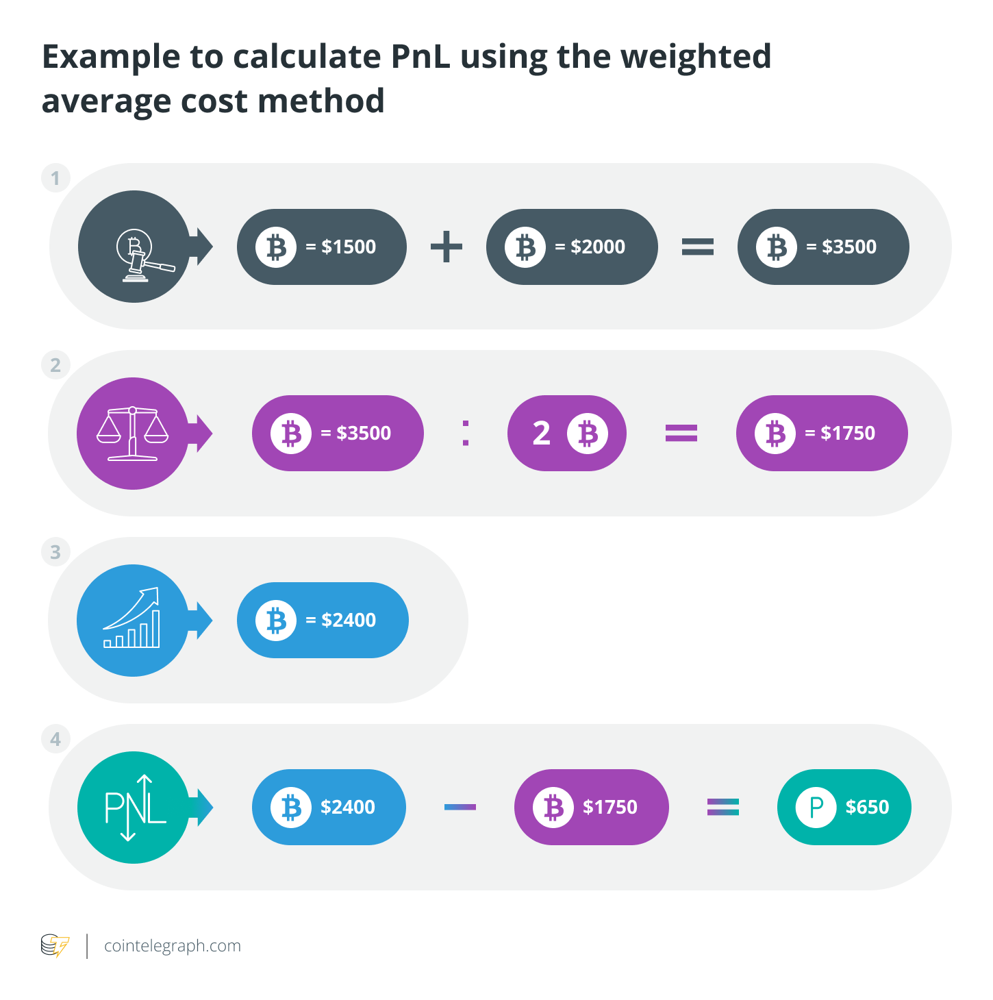

# paper-trading
There are several ways to calculate P&L, this is my chosen method :

Weighted average cost method
The weighted average cost method requires traders to determine the average cost of all units of a digital currency in their portfolio to arrive at the initial cost. Here are the steps to calculate PnL using this method:

1) Determine the total cost of all units of the cryptocurrency. Multiply the purchase price per unit for each transaction by the number of units of the asset and add the numbers.

2) To arrive at the weighted average cost per unit of the digital coin, divide the total cost of all units by the number of units.

3) Find the current market value of the cryptocurrency sold. Multiply the current market price per unit by the number of units sold.

4) To determine PnL, subtract the average cost per unit from the current market value.

Suppose Alice bought 1 BTC at $1,500 and a few days later bought 1 BTC at $2,000. She later sold 1 BTC at $2,400. Here is the PnL using the weighted average cost method:

Total cost = (1 BTC x $1,500) + (1 BTC x $2,000) = $3,500

Weighted average cost = $3,500 / 2 BTC = $1,750

Current market value = (1 BTC x $2,400) = $2,400

PnL = $2,400 - $1,750 = $650 (profit)

